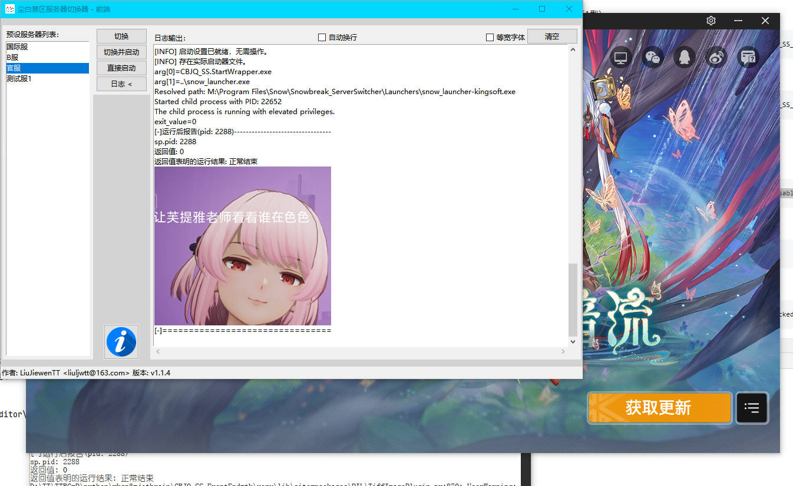
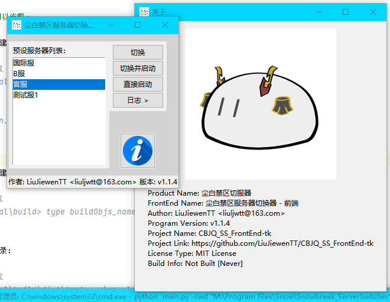
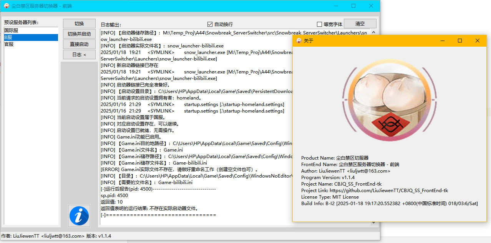

# 《尘白禁区》服务器切换器 前端（tk）

<div style="align-items: center; justify-content: center; display: flex; margin: 10px; gap: 10px">
   
   
   
   
</div>

此前端程序主要使用tkinter库实现。

当前版本已支持配置文件。

<div style="align-items: center; justify-content: center; display: flex; margin: 10px; gap: 20px">
   
   
   
</div>

## 构建

### 环境配置

作者的Python版本为`3.8.8`，使用的库见<venv/Lib/installation_notes/pip_list.txt>。

配置Virtual Environment:

``` shell
pip -r requirements.txt
```

### 构建exe

此项目使用PyInstaller-6.3.0构建。

## 使用

基本：

双击启动就行了，你也可以发送到桌面快捷方式，并在属性的兼容性选项卡中勾选管理员权限启动。

高级：

当前版本在当前路径下查找脚本`CBJQ_SS.main.bat`，可以通过`-cwd [path/to/script]`切换工作目录，或在配置文件中设定。

> 注：本程序只是前端，后端/内核请转到此项目下载：<https://github.com/LiuJiewenTT/Snowbreak_ServerSwitcher>。

<details open><summary>效果图合集</summary>
   <div style="gap: 15px">
      
      
      
      
      
   </div>
</details>

## 程序说明

版本说明：
1. A/B:
   1. A版为单文件版，且启用了upx压缩，运行前会临时解压到暂存目录下，因此启动较慢。
   2. B版为文件夹版，不保证一定提供此版本。
2. I:
   1. I表示Icon（图标），项目产品可能有多个图标版本，其后的数字表示[图标列表](图标列表.md)中的序号。

功能备注：

1. 程序可以自动生成**配置文件**，但适不适合你的情况要你自己检查。
2. 生成的配置文件会在每次程序正常退出时自动更新重写，但内部信息不会随意变动，持续保持原有数据，除非受到**启动参数的影响**（如`-cwd`）。（即：传参会修改储存的配置信息）
3. **运行后报告**需要后端版本不低于`v1.0.1`。

资源说明：

1. 本程序所有资源，若有侵权，请联系本人，本人将立即删除。本人无意侵害他人的权利，不会有意使用明确标注了版权的资源。
2. 为提升程序启动速度、减小程序体积和轻便升级程序版本，正式发行的版本默认不会嵌入大量资源文件。所有使用的非嵌入资源文件，通常可以从互联网轻松获得，本人不承诺一定会有自发布自用资源包。

### 配置文件说明

>  注：不同程序版本可能使用的配置文件不完全相同，若有出入，请依照此节说明进行更新。（不保证未来会有配置更新迁移功能。）

> 注：配置文件为 *JSON* 格式，参数请依照 JSON 基本规范修改。（JSON无注释，以下示例使用Python的注释方式不代表带着注释可以运行。）

``` json
{
  "LOCKCONFIG": false,						#设置程序结束是否可以更新此配置文件。取值：true/false
  "backend_path": "CBJQ_SS.main.bat",		# 设置后端程序CBJQ_SS.main.bat的文件路径。若为相对路径则受cwd影响。
  "server_list": {							# 设置显示的服务器列表和对应的用于传递给后端程序使其指定服务器的值
    "国际服": "worldwide",					# 格式："显示名称": "对应参数值"。显示名称必须唯一，不可重复。
    "B服": "bilibili",
    "官服": "kingsoft"
  },
  "showSplash": true,						# 显示启动页。true表示显示，false表示不显示。
  "splashWindowKind": "true-borderless",	# 设置启动页边框风格。
  "showSplash_autoSkipAfter": 0,			# 设置启动页自动跳过计时时长，低于（或等于）250ms不生效。
  "splashSize": [							# 设置启动页在启动时的最大尺寸。启动页会自动适配启动图尺寸。
    960,									# 宽度。单位：像素
    540										# 高度。单位：像素
  ],
  "showSplashRandomly": true,				# 设置是否随机选取启动图
  "splash_ImgPathInfoList": [				# 启动图列表
    {
      "path": "res\\启动页资源\\预设启动图\\截图\\屏幕截图(770).png",	# 图片路径
      "type": "buildin"											# 图片的路径类型，buildin表示程序自带，nonbuildin表示程序启动时的工作目录下依路径寻找，其它值视为无效并进行默认操作：在当前运行的工作目录依路径寻找。
    }
  ],
  "cwd": ".",								# 运行时的工作目录。
  "exec_noWindow": true,					# 运行后端时保持无窗口状态
  "printConfigOnWrite": false,				# 写入配置时是否打印内容
  "log_keepFlushing": true,					# 是否实时刷新写入日志的内容。
  "server_curselection": [					# 当前选择的，在服务器列表中供选择的服务器选项
    "B服"									# 使用“显示名称”而非“对应参数值”。
  ],
  "displayLog_ifWrapChar": true,				# 设置日志文本是否启用自动换行。
  "displayLog_text_ifUseFixedFont": false,		# 设置日志文本是否使用等宽字体。在Win10上，不使用等宽字体将会使用更好看的“微软雅黑”字体。
  "resutlBonus_pics_framesize": [			# 运行后报告显示的表情包的最大尺寸限制
    300,									# 宽度。单位：像素
    300										# 高度。单位：像素
  ],
  "resultBonus_pics_success_list": null,	# 运行后报告显示的在程序运行正常时的表情包。同上splash_ImgPathInfoList的格式。
  "resultBonus_pics_fail_list": null,		# 运行后报告显示的在程序运行出错时的表情包。同上splash_ImgPathInfoList的格式。
  "supervise_mode_support": "auto",			# 是否启用supervise适配以自动退出。取值：auto/disabled
  "enforce_use_pwd_config_state": "disabled"	# 设置强制使用程序目录内配置的严格级别。取值："disabled"不启用, "allow-arg-only"启用强制但放行命令行参数, "fully"完全启用禁用一切外部输入
}
```

> 供参考：在至今的较新的几个切服器发行版本中，"cwd"应当设为`"cwd": "..\\..\\..\\"`（仅限B型）。

## 版本选择说明

1. 完整的结果分析需要版本不低于`v1.1.0.5`。
2. 使用管理员启动本程序应当选择版本不低于`v1.1.1`，且后端版本不低于`v1.2.1`。
3. 异处启动支持（如*Live2DViewerEx的小部件“桌面图标”*）需要版本不低于`v1.1.2`，且后端版本不低于`v1.2.2`。

## License

当前版本使用：MIT License。
